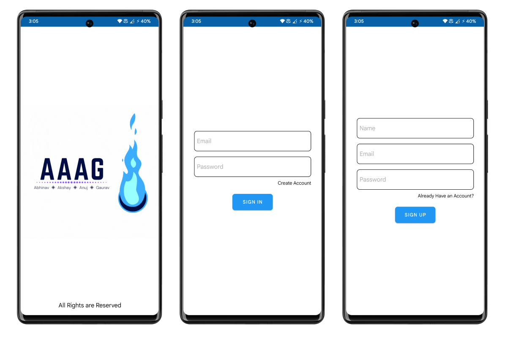
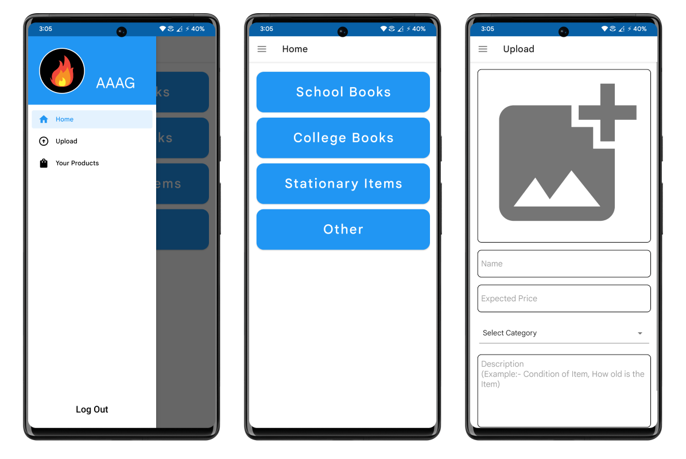
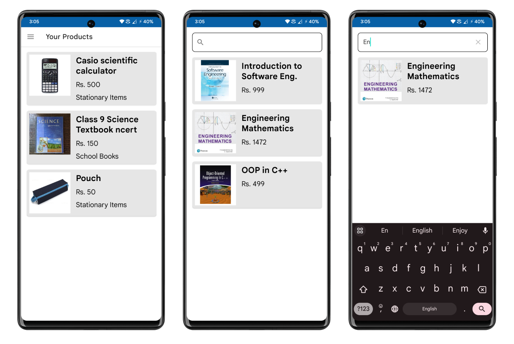

## Used School Supplies Hub Application
### This Android Application will allow students to sell, exchange or give their used academic books and other stationary items after their academic year is over. Users can upload the details of the books which they have and set the price as per their liking and give their contact details so that the buyers who need the books can contact them to make a purchase.

